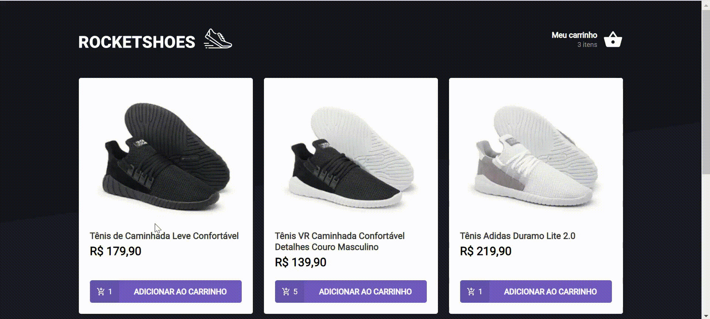
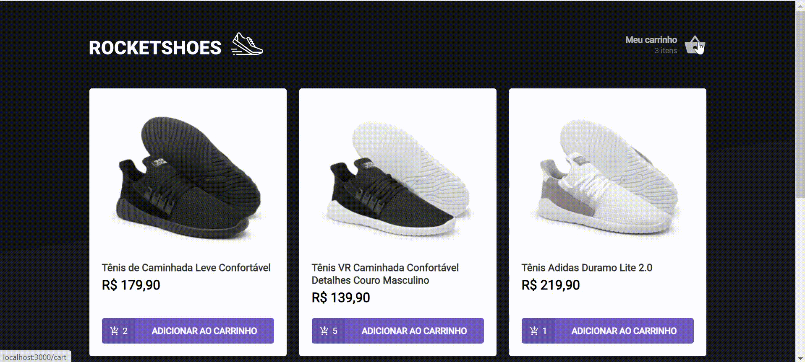

<h1 align="center">Desafio 3 - Carrinho de compras 👋</h1>

<p> 🚀 Desafio desenvolvido durante o ignite cujo objetivo principal é a criação de um hook de carrinho de compras. </p>

Tabela de conteúdos
=================
<!--ts-->
   * [Funcionalidades](#funcionalidades)
   * [Tecnologias](#tecnologias)
   * [Como executar o projeto](#como-executar-o-projeto)
      * [Pré-Requisitos](#pre-requisitos)
      * [Rodando a Aplicação](#rodando-a-aplicacao)
   * [Testes](#testes)
<!--te-->




## Funcionalidades

- [x] Adicionar um novo produto ao carrinho;
- [x] Remover um produto do carrinho;
- [x] Alterar a quantidade de um produto no carrinho;
- [x] Cálculo dos preços sub-total e total do carrinho;
- [x] Validação de estoque;
- [x] Exibição de mensagens de erro;

## 🛠 Tecnologias

As seguintes tecnologias foram utilizadas na construção deste projeto:
- [React](https://pt-br.reactjs.org/)
- [Context API](https://pt-br.reactjs.org/docs/context.html/)
- [JSON Server](https://www.npmjs.com/package/json-server)

## 🚀 Como executar o projeto

💡A aplicação precisa que o servidor esteja sendo executado para funcionar.

### Pré-requisitos

Antes de começar, você vai precisar ter instalado em sua máquina as seguintes ferramentas:
[Git](https://git-scm.com), [Node.js][nodejs]. 
Além disto é bom ter um editor para trabalhar com o código como [VSCode][vscode]

### 🧭 Rodando a aplicação web 

```bash
# Clone este repositório
$ git clone https://github.com/brunaschneiders/ignite-reactjs-challenge3-carrinho-compras.git

# Acesse a pasta do projeto no seu terminal/cmd
$ cd ignite-reactjs-challenge3-carrinho-compras

# Instale as dependências
$ yarn install

# Execute o servidor da aplicação em modo de desenvolvimento
$ yarn server

# Execute a aplicação em modo de desenvolvimento
$ yarn start

# A aplicação será aberta na porta:3000 - acesse http://localhost:3000
```

## Testes

```bash
# Execute os testes da aplicação dentro da pasta do projeto
$ yarn test
```

## Autor

👤 **Bruna Schneiders**

* Github: [@brunaschneiders](https://github.com/brunaschneiders)
* LinkedIn: [@bruna-schneiders](https://linkedin.com/in/bruna-schneiders)

***
_This README was generated with ❤️ by [readme-md-generator](https://github.com/kefranabg/readme-md-generator)_
